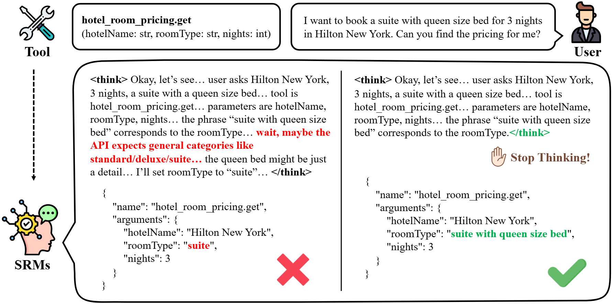

# ThinkBrake: Mitigating Overthinking in Tool Reasoning

[](https://arxiv.org/abs/2510.00546)
[](LICENSE)

Official implementation of **ThinkBrake: Mitigating Overthinking in Tool Reasoning**.

This codebase features a high-performance **asynchronous SGLang engine** to maximize GPU utilization and generation throughput.

## Overview

Small reasoning models often "overthink" — they reach a correct conclusion but continue generating until they hallucinate or overwrite the correct answer. **ThinkBrake** is a training-free decoding heuristic that addresses this by monitoring the log-probability margin between the end-of-thought token (`</think>`) and the top alternative token. When the model is confident enough to stop reasoning, ThinkBrake triggers early termination.

<p align="center">
  
</p>

## Installation

### Prerequisites
- Python 3.10+
- CUDA-enabled GPU
- `uv` (recommended) or `pip`

### Quick Start

1. **Clone the repository**
   ```bash
   git clone https://github.com/your-username/think-brake.git
   cd think-brake
   ```

2. **Install dependencies**
   ```bash
   bash install.sh
   ```

## Usage

### 1. Generation (ThinkBrake)

Run the generation script to apply the ThinkBrake heuristic. The script uses `asyncio` for fast batch processing.

```bash
python thinkbrake/scripts/generate.py \
  --model Qwen/Qwen3-4B-Thinking-2507 \
  --category math500,gsm8k \
  --threshold 1.0 \
  --num_workers 100 \
  --reasoning_tokens_budget 16384 \
  --answer_tokens_budget 4096
```

**Key Arguments:**
- `--model`: Model path or HuggingFace ID (e.g., `Qwen/Qwen3-4B-Thinking-2507`, `deepseek-ai/DeepSeek-R1-Distill-Llama-8B`).
- `--category`: Comma-separated list of datasets (e.g., `math500`, `gsm8k`, `gpqa-diamond`, `all`).
- `--threshold`: The log-probability threshold for early stopping.
- `--num_workers`: Number of concurrent async workers (default: 100). Higher values maximize throughput.
- `--tensor_parallel_size`: Number of GPUs to use per model instance.

### 2. Rollout (Standard Generation)

To run standard generation (without ThinkBrake early stopping) for baselines:

```bash
python thinkbrake/scripts/rollout.py \
  --model Qwen/Qwen3-4B-Thinking-2507 \
  --category math500 \
  --num_workers 100
```

### 3. Evaluation

Evaluate the generated results against ground truth:

```bash
python thinkbrake/scripts/evaluate.py \
  --model Qwen/Qwen3-4B-Thinking-2507 \
  --category math500
```

### Using Shell Scripts

Convenience scripts are provided in the root directory:

```bash
# Run ThinkBrake generation
bash run_generate.sh

# Run baseline rollout
bash run_rollout.sh

# Evaluate results
bash run_evaluate.sh
```

## Supported Models & Datasets

**Models:**
- `Qwen/Qwen3-4B-Thinking-2507`
- `Qwen/Qwen3-14B`
- `deepseek-ai/DeepSeek-R1-Distill-Llama-8B`

**Datasets:**
- **Math**: `gsm8k`, `math500`, `aime2024`, `aime2025`
- **General**: `gpqa-diamond`, `mmlu-pro`

## Citation

```bibtex
@article{oh2025thinkbrake,
  title={ThinkBrake: Mitigating Overthinking in Tool Reasoning},
  author={Oh, Minjae and Song, Sangjun and Lee, Seungkyu and Jo, Sungmin and Jo, Yohan},
  journal={arXiv preprint arXiv:2510.00546},
  year={2025}
}
```
